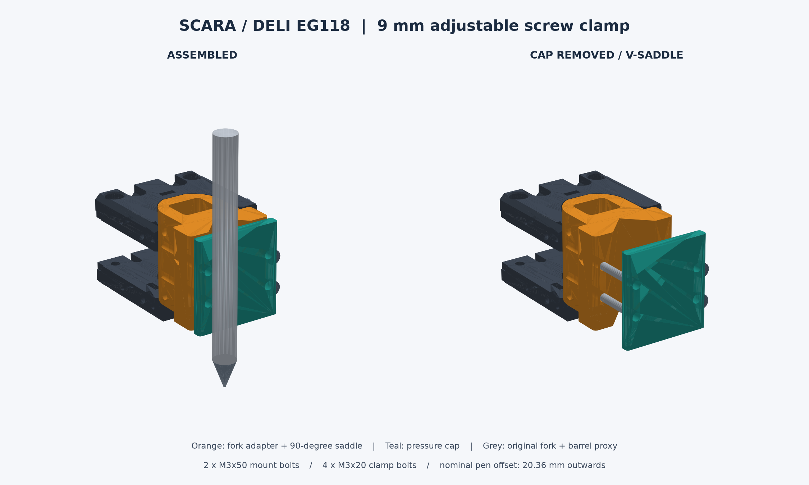
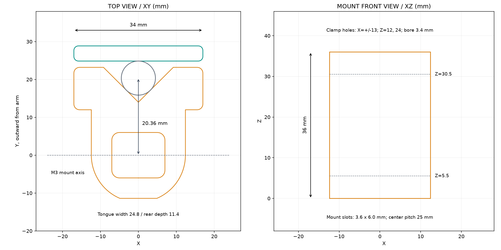

# Giá giữ bút Deli EG118 cho đầu SCARA — bản 1

Đã dựng theo hai STL `Arm_Elbow_Plate_Top_1.0.0.stl`, `Arm_Elbow_Plate_Bottom_1.0.0.stl` và chiều cao 18 mm của sidewall trong `Hardware/arm`. Thân bút lấy theo số đo bạn cung cấp: **khoảng 9 mm**, có thể sai ±0,5 mm.

Giá gồm thân gá vào hai ngàm chữ U và một nắp ép bút vào rãnh V 90°. Hai mặt V cùng mặt ép tạo ba hướng tiếp xúc, giúp căn bút thẳng. Hai ốc xuyên ngang giữ giá vào robot; bốn ốc riêng siết nắp giữ bút. Có thể nới nắp để chỉnh độ thò ngòi hoặc thay bút. Khoảng đường kính đã kiểm tra hình học: **8,5–9,5 mm**.

## File để in

| File trong `STL/` | Số lượng | Công dụng | Kích thước đặt trên bàn in, mm |
| --- | ---: | --- | --- |
| `01_Fork_Adapter_V_Saddle.stl` | 1 | Thân gá và rãnh V | 34 × 34,6 × 36 |
| `02_Pressure_Cap.stl` | 1 | Nắp ép bút | 34 × 36 × 4 |
| `03_Test_Adapter_8mm.stl` | 1, nên in trước | Mẫu thấp để thử ngàm, lỗ ốc và độ vừa bút | 34 × 34,6 × 8 |
| `04_Test_Cap_8mm.stl` | 1, nên in trước | Nắp cho mẫu thử | 34 × 8 × 4 |

STL dùng **mm**, đã đặt đáy ở Z=0 và hướng in sẵn. Giữ tỷ lệ **100%** trong slicer. In mẫu 03/04 trước; mẫu thử chỉ dùng kiểm tra độ vừa, không dùng vẽ trên robot.

`assembly_reference.glb` và `assembly_reference.stl` là hình tham khảo ở tọa độ lắp ráp. **Chỉ in từng file trong `STL/`.** Bút trong hình là hình trụ minh họa đường kính, không mô phỏng chi tiết thân hoặc chiều dài EG118.

## Ốc và đai ốc

| Vật tư | Số lượng | Chỗ dùng |
| --- | ---: | --- |
| Ốc đầu trụ M3×50 | 2 | Xuyên qua hai tai ngàm robot và thân gá |
| Đai ốc M3 | 2 | Giữ hai ốc gá, ở mặt ngoài ngàm |
| Long đen M3 | 4 | Đệm hai phía ngoài ngàm |
| Ốc đầu trụ M3×20 | 4 | Siết nắp ép bút |
| Đai ốc M3, ngang cạnh khoảng 5,5 mm, dày ≤2,6 mm | 4 | Gài vào hốc lục giác ở phía sau thân rãnh V |

Chiều dài ốc dự kiến theo STL. Kiểm tra trên robot thật: ren phải đi hết đai ốc và nhô ra khoảng 1–2 vòng. Nếu ngàm có sẵn đai ốc chôn, tháo đai ốc nằm trên đường xuyên của ốc dài để không cản lắp. Nắp ép dùng đai ốc kim loại; không cần tarô nhựa.

## Kích thước giao tiếp và phần cần đo

| Kích thước | Giá trị / căn cứ |
| --- | --- |
| Khoảng rộng giữa hai tai chữ U | 25,5 mm, đo từ STL |
| Bề rộng phần chèn của giá | 24,8 mm, chừa tổng 0,7 mm |
| Mặt phẳng đáy trong của cung ngàm | Cách tâm cung 11,75 mm, đo từ STL |
| Mặt phẳng đáy phần chèn | Cách tâm cung 11,4 mm |
| Bề dày mỗi tấm ngàm | 9 mm, đo từ STL |
| Khoảng trống giữa hai tấm | **Giả định 18 mm**, theo sidewall |
| Tổng chiều cao cụm | **Giả định 36 mm** = 9 + 18 + 9 |
| Khoảng cách tâm hai ốc ngang | **25 mm**, theo cách lắp hai tấm đối mặt |
| Rãnh cho ốc gá | Rộng 3,6 mm, cao 6 mm; tâm tại Z=5,5 và 30,5 mm |
| Lỗ ốc nắp ép | Ø3,4 mm; X=±13 mm; Z=12 và 24 mm |
| Hốc đai ốc của nắp | Ngang cạnh 5,8 mm, sâu 2,6 mm |

**Đo lại chiều cao cụm và khoảng cách tâm hai ốc ngang trên robot đã lắp.** Ảnh không đủ xác định chính xác khoảng cách này. Rãnh đứng cho phép dịch tâm ốc khoảng ±1,2 mm so với danh định; nếu khác nhiều hơn, chỉnh `mount_centers_z`/`height` trong SCAD trước khi in thân hoàn chỉnh.

## In và thử độ vừa

- Có thể dùng PETG hoặc PLA. Gợi ý khởi đầu: lớp 0,2 mm, 4 vách, 5 lớp đáy/nóc, infill 35–45%. PETG phù hợp nếu tháo lắp thường xuyên; PLA cũng dùng để thử và vẽ tải nhẹ.
- Thân chính in đứng theo file. Nắp in nằm trên mặt ngoài phẳng như đã xuất. Các lỗ ngang nhỏ có thể in cầu; kiểm tra preview slicer, thường không cần support. Chỉ thêm support cục bộ nếu máy của bạn in cầu kém.
- Làm sạch ba via. Thử ốc M3 qua lỗ bằng tay; nếu cần, làm sạch lỗ nắp bằng mũi 3,2–3,4 mm. Không ép ốc vào khi kẹt.
- Đưa mẫu 03 vào một ngàm để thử độ vừa và đường đi của ốc ngang. Tháo mẫu khỏi robot rồi lắp nắp 04 với hai đai ốc và hai ốc M3×20 để thử kẹp bút trên bàn. Cách này tránh đầu ốc mẫu thấp vướng tấm ngàm.
- Chọn đoạn thân tròn, thẳng, không có kẹp áo hoặc nút bấm. Bút phải tì vào cả hai mặt V. Sai số đường kính được bù bằng vị trí nắp, không cần ép bút vào một lỗ kín.
- Khi mẫu ổn, in 01 và 02. Nếu phần chèn quá chặt, giảm `fork_radius` khoảng 0,1–0,2 mm và thử lại. Giữ nguyên kích thước lỗ ốc; tránh scale toàn bộ mô hình.

## Lắp lên robot

1. Tháo ốc ngang ở đầu ngàm để đưa thân giá vào từ phía mở của chữ U. Rãnh V và nắp quay ra ngoài đầu tay robot.
2. Căn hai rãnh của thân giá với hai lỗ ngang trên robot. Luồn hai ốc M3×50, thêm long đen và đai ốc ở ngoài. Siết đều vừa đủ để giá không xoay hoặc trượt; thử bằng tay trước khi chạy.
3. Gài bốn đai ốc vào các hốc sau thân rãnh V, tại hai hàng Z=12 và 24 mm. Có thể dùng một chấm băng dính tạm giữ đai ốc khi lắp.
4. Đặt bút vào V, bấm ngòi ra, lắp nắp và bốn ốc M3×20. Siết luân phiên bốn ốc, giữ nắp song song với thân giá. Chỉnh độ thò ngòi trước khi siết chặt.
5. Với bút Ø9 mm, khe giữa tai nắp và thân khoảng **1,66 mm**; Ø8,5–9,5 mm cho khe khoảng **1,06–2,27 mm**. Không cần siết cho hai tai chạm nhau. Dừng khi bút không trượt dưới lực viết nhẹ; siết quá mạnh có thể làm biến dạng thân bút.
6. Cho robot chạy chậm và kiểm tra khoảng hở thực tế tại các tư thế sẽ vẽ. Đặt mặt giấy phẳng và chỉnh Z để ngòi vừa chạm giấy, sau đó tăng lực tiếp xúc từng ít một.

## Hiệu chỉnh vị trí ngòi

Hai ốc gá ngang đi qua vùng tâm ngàm nên bút được đưa ra phía trước để tránh chúng. Với thân Ø9 mm, trục bút cách tâm ngàm **20,364 mm theo hướng ra ngoài của tay robot**, X=0. Rãnh V làm vị trí này thay đổi nhẹ theo đường kính:

`độ lệch Y = 14 + đường kính thân / √2` (mm).

Trong khoảng 8,5–9,5 mm, độ lệch Y là **20,010–20,718 mm**. Đo ngòi thực sau khi siết và hiệu chỉnh offset công cụ/IK theo quy ước tọa độ phần mềm bạn đang dùng. Nếu IK của bạn đang lấy L2=98 mm từ khớp khuỷu đến tâm ngàm và đầu bút nằm thẳng theo hướng tay, khoảng cách đến trục bút danh định thành khoảng **118,364 mm**. Không cộng cả độ lệch này vào L2 và tool offset cùng lúc.

Giá này **giữ bút cứng, không có lò xo bù lực theo Z**. Độ đều nét còn phụ thuộc mặt giấy, độ rơ robot, chỉnh Z và lực viết. Hiệu chỉnh lại Z sau khi thay bút hoặc đổi độ thò ngòi.

## File nguồn và kiểm tra

- `EG118_Holder.scad`: nguồn CAD tham số. Mở bằng OpenSCAD, chọn `part="base"` hoặc `"cap_print"`, render rồi export STL. Chọn `"test_base"`, `"test_cap_print"` để in thử. `"assembly"` để xem lắp ráp. Nguồn SCAD chưa được biên dịch trong môi trường tạo file; STL cung cấp được sinh và kiểm tra bằng Manifold.
- `build_holder.py` và `requirements.txt`: sinh lại STL, hình xem trước và báo cáo. Chạy `python build_holder.py --pen-diameter 9` trong thư mục này sau khi cài dependencies. Script hiện kiểm tra bộ gá 36 mm; các sửa đổi khoảng cách ngàm trong SCAD cần kiểm tra lại trên robot thật.
- `validation.json`: bốn STL đều kín, hướng mặt nhất quán và mỗi file có một khối liền. 13 kiểm tra hình học đã qua: giao cắt giá với hai STL ngàm bằng 0; đường đi hai ốc gá và bốn ốc kẹp thông; bút trụ 8,5 / 9 / 9,5 mm vừa giữa các mặt ép.
- Các kiểm tra trên là kiểm tra hình học theo cách lắp giả định, **chưa phải kiểm chứng bản in hoặc lực siết thực tế**. Chưa đánh giá tải động, độ bền lâu dài hay toàn bộ hành trình robot.
- `source_geometry.png`, `plate_sections.png`, `interface_detail.png`: hình dùng đối chiếu với file gốc.

Thông tin Deli EG118: [trang sản phẩm Deli Việt Nam](https://delivietnam.com.vn/san-pham/but-gel-bam-deli-eg118-cong-nghe-muc-sieu-muot-giam-ma-sat). Thông số 0,5 mm trên trang là **ngòi viết**; đường kính thân dùng thiết kế này lấy từ số đo 9 mm của bạn.

Các mesh ngàm gốc dùng làm tham khảo thuộc X-SCARA của madl3x, nguồn và GPL-3.0 được ghi trong `Simulation/common/assets/manifest.json`. Bản xem trước và cảnh 3D có chứa hình học tham khảo từ các mesh đó; xem `SOURCE_LICENSE.txt` và `NOTICE.txt`.
