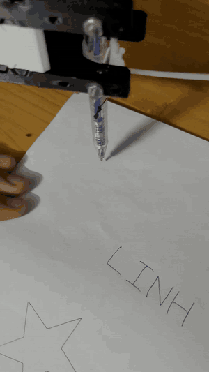
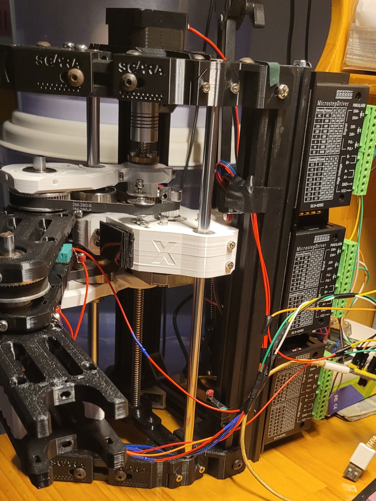
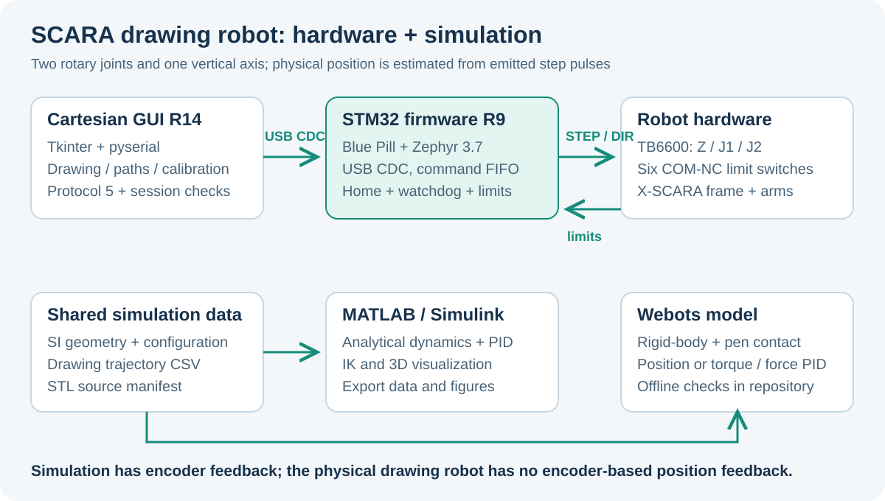
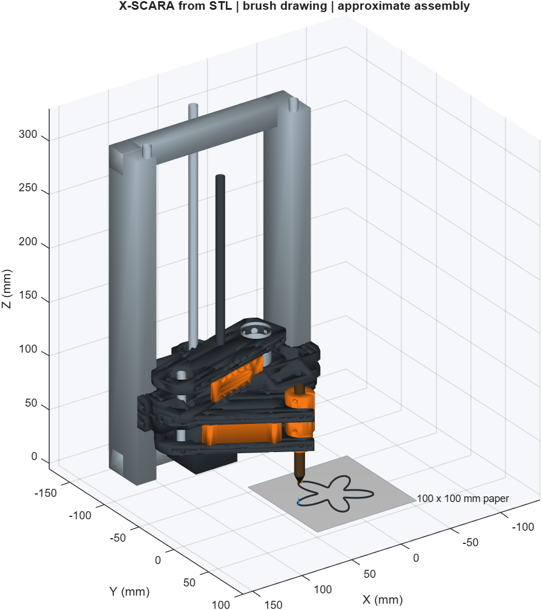

# SCARA Drawing Robot

A 2R + Z pen-drawing robot with STM32/Zephyr firmware, a Python Cartesian GUI, and MATLAB/Simulink + Webots models.

[English](#english) | [Tiếng Việt](#tieng-viet)

<p align="center">
  
  
</p>

The checked-in drawing demo is shown at 2x speed. [Original video](media/drawing-demo.mp4) | [Side view](media/robot-side-1.jpg) | [Driver reference photo](media/tb6600-driver.jpg).



<a id="english"></a>

## English

This HPMR course project (HK261) controls a SCARA robot that draws shapes and text on paper. Two rotary joints position the pen in XY and a vertical lead-screw axis raises or lowers the arm assembly. The PC performs kinematics and path planning; the STM32 emits coordinated step pulses and handles homing, limits, and communication faults.

**The frame and arm mechanics originate from [madl3x/X-SCARA](https://github.com/madl3x/x-scara/tree/master), GPL-3.0.** The STL files, mechanical BOMs, and assembly images in `Hardware/arm`, `Hardware/frame`, and `Hardware/3D Print` retain that attribution. This project's additions include firmware, GUI, simulation, and a Deli EG118 pen holder fitted to the reference geometry.

### Current components

| Component | Current version / role |
| --- | --- |
| Physical controller | STM32F103C8 Blue Pill, USB CDC, Zephyr 3.7 |
| Firmware | `SCARA_CART_NC_HOME_V5_R9`, protocol 5 |
| Desktop GUI | R14, Python 3.12 + Tkinter + pyserial |
| Stepper system | Three NEMA 17 motors and TB6600 STEP/DIR drivers |
| Homing | Six COM-NC limit switches, two per axis |
| Mechanical defaults | L1/L2 98 mm, Z lead 2 mm/revolution, configured microsteps Z/J1/J2 = 16/8/8 |
| Simulation | Analytical MATLAB/Simulink model and a separate Webots rigid-body model |

Mechanical numbers are **configuration defaults**, not measurements of every assembled robot. The real robot has no encoder-based position feedback. Its displayed Cartesian position is derived from the firmware's emitted pulse counts.

### What the system does

- Cartesian jogging, forward/inverse kinematics, reach checking, mechanical-model editing, and test point sequences.
- Shape/text library including BK, LINH, THOA, flower, star, heart, circle, ellipse, square, triangle, and rhombus.
- Whole-stroke preflight before uploading `PATH` / `SEG` / `GO` commands to a 32-segment firmware FIFO.
- Coordinated three-axis DDA step generation using a 1 MHz TIM2 timebase and fixed-point velocity profiles. The timebase is not a 1 MHz motor step rate.
- HOME/CALIB sweeps and a measured elbow-coupling probe; GPIO checks, soft limits, USB/heartbeat monitoring, and buffer-underrun handling.
- JSONL session logging and offline drawing audits.
- A `--demo` GUI mode that uses a simulated link without opening a real COM port.

### Repository map

| Path | Contents |
| --- | --- |
| [Firmware/ScaraCartesian](Firmware/ScaraCartesian) | Active Zephyr source, host tests, build tools, and supplied HEX/BIN |
| [Firmware/Ref](Firmware/Ref) | Original STM32CubeIDE/HAL project retained as reference |
| [Software/src](Software/src) | GUI, kinematic model, protocol, path planning, shapes, logs, audits |
| [Software/tests](Software/tests) | Python tests and GUI smoke checks using simulated ports |
| [Software/packaging](Software/packaging) | R14 PyInstaller specification |
| [Simulation/common](Simulation/common) | Shared SI parameters, CSV trajectories, converted meshes, provenance |
| [Simulation/matlab](Simulation/matlab) | MATLAB app, dynamics/control modules, editable Simulink model |
| [Simulation/webots](Simulation/webots) | World, PROTOs, Python controller, builder, offline checks |
| [Hardware](Hardware) | X-SCARA print files/BOMs/assembly images and EG118 holder |
| [Doc](Doc) | Firmware review and discussion of drawing errors |
| [media](media) | Photos and drawing demonstration of the physical robot |

### Try the GUI without hardware

From the repository root on Windows, with Python 3.12 and Tkinter available:

```powershell
git clone https://github.com/TuanLinh05/SCARA-Robot.git
cd SCARA-Robot
py -3.12 -m pip install -r Software\requirements.txt
py -3.12 Software\src\cartesian_nc_control.py --demo
```

The runtime requirement file pins `pyserial==3.5`; Tkinter is part of the Python environment. Demo mode lets you inspect the GUI flow without serial hardware, but it does not validate motor behavior or drawing accuracy.

For the physical connection, omit `--demo`:

```powershell
py -3.12 Software\src\cartesian_nc_control.py
```

Alternatively, `Software/Run_Cartesian_GUI.bat` uses an existing R14 EXE if present, otherwise tries a configured Zephyr Python environment and then `py -3`. A fresh clone does not include `Software/dist`.

To package the GUI from the root:

```powershell
.\Software\Build_Cartesian_NC_GUI.ps1 -Python python
```

The script can install its build dependencies into `Software/.packaging` and produces `Software/dist/SCARA_Cartesian_NC_v5_R14`. Keep the EXE and its `_internal` directory together. See [Software/README.md](Software/README.md) for configuration/log locations and the module organization.

### Wiring

The TB6600 input arrangement is common-cathode: **PUL-, DIR-, and ENA- connect to shared GND**. Check the actual driver's input characteristics and current/microstep settings against your board and motors.

| Axis | PUL+ | DIR+ | ENA+ | DIR HIGH-end switch | DIR LOW-end switch |
| --- | --- | --- | --- | --- | --- |
| Z | PA0 | PA1 | PA2 | PA3, top | PA4, bottom |
| J1 | PA8 | PB15 | PB14 | PB0 | PB1 |
| J2 | PA6 | PA7 | PB13 | PB10 | PB11 |

The [Zephyr overlay](Firmware/ScaraCartesian/app.overlay) configures ENA outputs active LOW. Switches use **COM -> GND, NC -> GPIO**, with internal 3.3 V pull-ups; NO is unused. Normal closed wiring reads LOW, while an actuated switch or open wire reads HIGH.

USB CDC uses the Blue Pill's micro-USB port: PA11 D-, PA12 D+. The GUI opens the virtual COM port at the configured 115200 baud; no separate USB-UART console is used by the active firmware.

Assembly resources: [print list](Hardware/3D%20Print/README.md), [arm BOM](Hardware/arm/BOM.md), [frame BOM](Hardware/frame/BOM.md), and [EG118 pen holder](Hardware/Pen_Holder_EG118/README.md). The print collection is organized as 14 frame parts, 23 arm parts, and one test part.

### Firmware build and supplied images

The current images are [SCARA_Cartesian_NC_Home_v5_R9.hex](Firmware/ScaraCartesian/Hex/SCARA_Cartesian_NC_Home_v5_R9.hex) and [the matching named BIN](Firmware/ScaraCartesian/Hex/SCARA_Cartesian_NC_Home_v5_R9.bin). The documented flash base is `0x08000000`; use an ST-Link/programmer configured for the actual STM32F103C8 board.

The source build expects Zephyr 3.7, Zephyr SDK 0.16.8, CMake, Ninja, and a Python/Zephyr workspace. The PowerShell helper accepts installation-path overrides:

```powershell
# Example paths: replace with your Zephyr workspace and SDK locations.
.\Firmware\ScaraCartesian\tools\build.ps1 `
  -ZephyrRoot D:/zephyrproject `
  -SdkRoot D:/zephyr-sdk/zephyr-sdk-0.16.8 `
  -BuildDirectory build_refactor -SkipExport
```

It builds board `stm32_min_dev@blue` and creates/checks a `scara_cartesian_workspace` junction under the Zephyr workspace to avoid paths with spaces. `-SkipExport` leaves the supplied `Hex` directory untouched; without it, the helper exports new HEX/BIN images there. Read [the firmware guide](Firmware/ScaraCartesian/README.md) before building or programming a board.

The GUI parser requires firmware build `SCARA_CART_NC_HOME_V5_R9` and protocol-5 status. A connected port alone does not establish firmware compatibility.

### Home, calibration, and drawing

1. Connect the correct COM port and confirm the firmware tag.
2. Review **Cơ khí** (Mechanics): link lengths, lead, microsteps, switch angles, direction signs, and tool offset must reflect the assembled robot.
3. Use **HOME / CALIB** to establish a reference. The routine scans Z/J2, probes J1-to-J2 coupling, scans J1 with compensation, then finishes the joint reference and park position.
4. Bring the pen just into contact and capture/confirm **Z giấy** (paper Z).
5. Choose **Thư viện hình & chữ** (Shape & text library), set size/center, and run **Chạy khô** (dry run) before drawing.
6. Following STOP/Esc, a reset, communication failure, limit fault, or loss of reference, HOME again before further motion.

Default `positive_high=[true,true,false]` accounts for J2's direction convention. Do not reverse signs without checking the mechanism. `tool_offset_mm=[x,y]` represents pen-tip offset from the end of L2; avoid counting the same offset in both L2 and this vector. Save mechanical changes and HOME again.

Calibration measures pulse travel and coupling. **It does not discover the true physical switch angles, link lengths, pen deflection, or missed motor steps.** Enter measured geometry instead of assuming the nominal ±90-degree switch positions are exact.

The firmware checks switch state on pulse edges, enforces soft limits, and uses a 350 ms heartbeat watchdog. Motion/arm paths are capped at 1600 pulses/s; Z calibration has a separate ceiling. These are code limits, not verified speed/accuracy specifications. Faults invalidate the reference and do not automatically resume a job.

### MATLAB/Simulink and Webots

Both models use [Simulation/common/config/scara.json](Simulation/common/config/scara.json) and shared drawing CSVs. Simulation parameters use SI units; `example_drawing.csv` uses `x_mm,y_mm,pen`, with each row's pen state applying to the segment from the previous row.

| Environment | Entry point | Requirements / limits |
| --- | --- | --- |
| MATLAB | Set Current Folder to `Simulation/matlab`, run `run_scara` | Base MATLAB supports the app/analytical model; Robotics System Toolbox and Simscape Multibody are not required |
| Simulink | `startup_scara; out=scara_simulink('flower');` | Simulink is required for the `.slx` model |
| Webots | Open `Simulation/webots/worlds/scara_draw.wbt`, then Run | Python 3 standard-library controller; no ROS or NumPy requirement |



The MATLAB guide records execution on R2026a Update 2. Webots assets use the R2025a format; the checked-in guide reports offline/mock validation and leaves actual Webots physics execution unconfirmed. Offline checks are not evidence of a successful physical simulation run.

Webots `config/demo.json` selects `flower`, `circle`, `square`, or `csv`, and `position` or `pid` control. MATLAB analytical dynamics and Webots rigid-body/contact dynamics are different plants. Mesh geometry, inertias, simplified collisions, and brush stiffness/friction need calibration before comparing with hardware.

### Checks, logs, and accuracy limits

Existing verification entry points, from the repository root:

```powershell
# Host C firmware harness, then software tests; GUI checks use simulated ports.
.\Verify_SCARA.ps1 -Python python -Gcc gcc -Gui

# Webots offline checks; this does not launch the Webots simulator.
python -m unittest discover -s Simulation/webots/tests -v
```

The host firmware checks require GCC. The scripts may generate build/cache files. These commands are available to developers; no runtime tests or hardware operation are implied by this README update.

To inspect a saved session without opening COM:

```powershell
python Software/src/cartesian_nc_audit.py path/to/session.jsonl --out Software/reports/drawing_audit
```

The logs describe commands, timing, queue state, and pulse-coordinate telemetry. They cannot detect physical missed steps, belt backlash, paper movement, or pen flex. A correct final pulse count does not prove that the pen reached the requested point.

For distorted drawings, measure switch angles, motor/DIP settings, link lengths, and tool offset; compare lower and higher speeds with light pen pressure; inspect belt tension and holder rigidity. The [dated firmware review](Doc/Danh_gia_Firmware_SCARA.md) and [drawing audit](Software/reports/drawing_audit_20261008.md) provide diagnostic context. Their pulse/log inferences should not be treated as direct measurements of pen accuracy or automatically applied to every configuration.

### Documentation, credits, and license

Detailed component guides are primarily Vietnamese: [firmware](Firmware/ScaraCartesian/README.md), [GUI](Software/README.md), [simulation overview](Simulation/README.md), [MATLAB](Simulation/matlab/README.md), and [Webots](Simulation/webots/README.md).

- Frame/arm STL, BOMs, and assembly images: [madl3x/x-scara](https://github.com/madl3x/x-scara/tree/master), by [@madl3x](https://github.com/madl3x), source commit `3c7c17e`, GPL-3.0.
- Simulation mesh conversions record sources/hashes in [manifest.json](Simulation/common/assets/manifest.json).
- Pen-holder source and derivative reference geometry are described in [NOTICE.txt](Hardware/Pen_Holder_EG118/NOTICE.txt) and [SOURCE_LICENSE.txt](Hardware/Pen_Holder_EG118/SOURCE_LICENSE.txt).
- `Firmware/Ref` retains generated STM32CubeMX/HAL code and STMicroelectronics notices.

The repository is released under [GNU GPL v3.0](LICENSE). Project author: [Vu Tuan Linh](https://github.com/TuanLinh05), HPMR / HK261.

<a id="tieng-viet"></a>

## Tiếng Việt

Project môn HPMR (HK261) điều khiển robot SCARA vẽ hình/chữ lên giấy. Hai khớp quay tạo chuyển động XY, trục Z nâng/hạ cụm tay. GUI tính động học và lập đường đi; STM32 phát xung phối hợp, HOME và giám sát lỗi.

**Khung và tay robot lấy từ [X-SCARA của madl3x](https://github.com/madl3x/x-scara/tree/master), GPL-3.0.** STL, BOM và ảnh lắp ráp giữ ghi nhận nguồn này. Phần bổ sung gồm firmware, GUI, mô phỏng và giá bút EG118; mesh/giá bút có manifest và NOTICE nguồn.

### Chạy GUI và kết nối

Phiên bản hiện tại: GUI R14, firmware `SCARA_CART_NC_HOME_V5_R9`, protocol 5, Blue Pill STM32F103C8 và Zephyr 3.7. GUI dùng Python 3.12, Tkinter và pyserial 3.5.

Từ gốc repo:

```powershell
py -3.12 -m pip install -r Software\requirements.txt
py -3.12 Software\src\cartesian_nc_control.py --demo
```

`--demo` dùng cổng giả lập, không mở COM thật. Bỏ cờ này để chạy GUI kết nối robot. `Software/Run_Cartesian_GUI.bat` ưu tiên EXE đã có, rồi thử Python; bản clone mới không có `Software/dist`. Lệnh đóng gói và build firmware ở phần tiếng Anh nhận đường dẫn công cụ theo máy của bạn.

### Đấu dây và HOME

TB6600 nối chung âm PUL-/DIR-/ENA- về GND. Bảng chân đầy đủ ở phần tiếng Anh: Z dùng PA0/PA1/PA2; J1 dùng PA8/PB15/PB14; J2 dùng PA6/PA7/PB13. USB CDC qua PA11 D-/PA12 D+, không cần USB-UART riêng. Công tắc COM -> GND, NC -> GPIO kéo lên 3.3 V; bình thường LOW, chạm/hở dây HIGH.

1. Chọn COM và xác nhận firmware R9/protocol 5.
2. Kiểm tra **Cơ khí**: L1/L2, lead Z, vi bước, góc công tắc, dấu chiều và lệch đầu bút.
3. HOME / CALIB, sau đó lấy/xác nhận Z giấy khi bút vừa chạm.
4. Chọn hình/chữ, cỡ và tâm; chạy khô trước khi vẽ.
5. Dừng/Esc, mất USB/heartbeat, lỗi biên hoặc reset làm mất mốc; cần HOME lại.

L1/L2 98 mm, lead 2 mm/vòng và vi bước 16/8/8 là mặc định cấu hình. HOME đo số xung và hệ số ghép, **không tự đo góc công tắc thật hoặc vị trí ngòi bút**. Đừng cộng cùng một độ lệch vào cả L2 và `tool_offset_mm`. Sau khi đổi cơ khí, lưu rồi HOME lại.

### Mô phỏng, log và giới hạn

- MATLAB: vào `Simulation/matlab`, chạy `run_scara`; Simulink cần cho file SLX. Tài liệu ghi nhận chạy trên R2026a Update 2.
- Webots: mở `Simulation/webots/worlds/scara_draw.wbt`, nhấn Run. Controller chỉ cần thư viện chuẩn Python; world dùng format R2025a. Tài liệu hiện chỉ xác nhận kiểm tra offline/mock, chưa xác nhận chạy vật lý Webots thật.
- Hai môi trường chia sẻ tham số SI và CSV trong `Simulation/common`; mô hình động lực học/tiếp xúc khác nhau và còn dùng thông số ước lượng.
- `Verify_SCARA.ps1 -Gui` chạy harness firmware trên máy rồi các kiểm thử GUI bằng cổng giả lập; không điều khiển robot. GCC cần cho harness.
- Công cụ `cartesian_nc_audit.py` đọc JSONL mà không mở COM. Log ghi lệnh và tọa độ xung, không đo mất bước, độ rơ, bút võng hoặc giấy dịch.

Robot thật **không có encoder**. Số xung đúng không chứng minh đầu bút đã tới đúng điểm. Khi hình lệch/méo, đo lại góc biên và chiều dài/offset, kiểm tra DIP driver, đai và giá bút; so sánh tốc độ thấp/cao với lực tì nhẹ. Các kết luận trong [đánh giá firmware](Doc/Danh_gia_Firmware_SCARA.md) là ngữ cảnh chẩn đoán cho log/cấu hình tại thời điểm đó, không phải phép đo độ chính xác cho mọi robot.

Repo phát hành theo [GNU GPL v3.0](LICENSE). Giữ ghi nhận [madl3x/X-SCARA](https://github.com/madl3x/x-scara) và giấy phép nguồn khi dùng lại. Tác giả project: [Vu Tuan Linh](https://github.com/TuanLinh05), HPMR / HK261.
