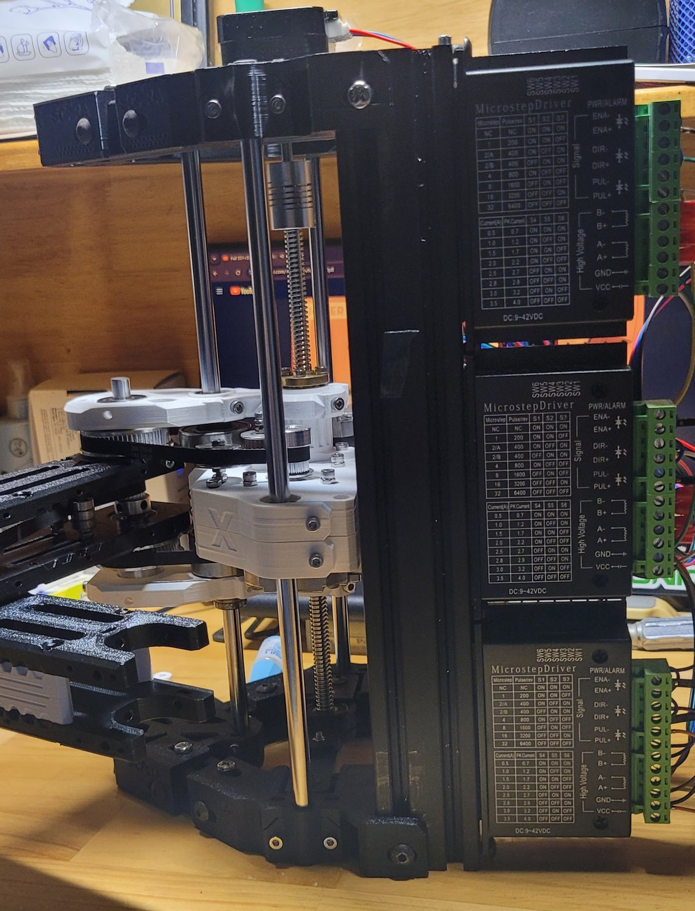
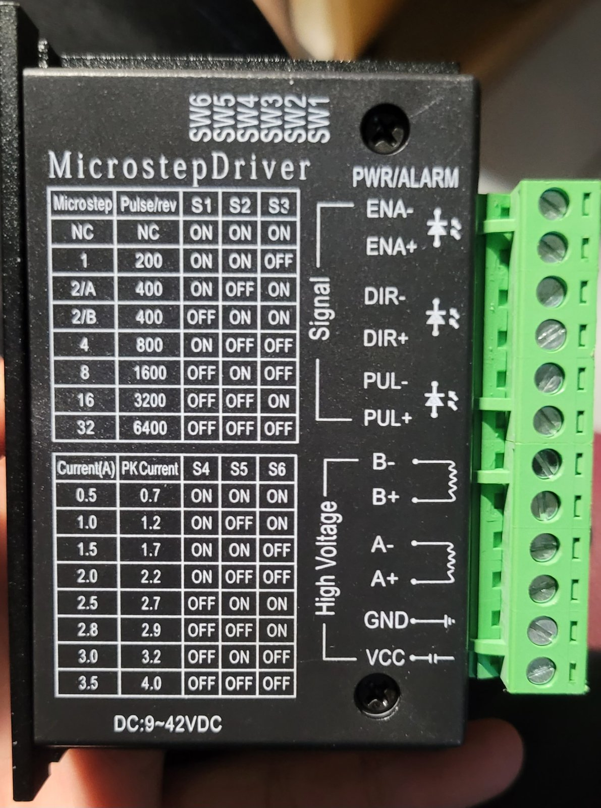
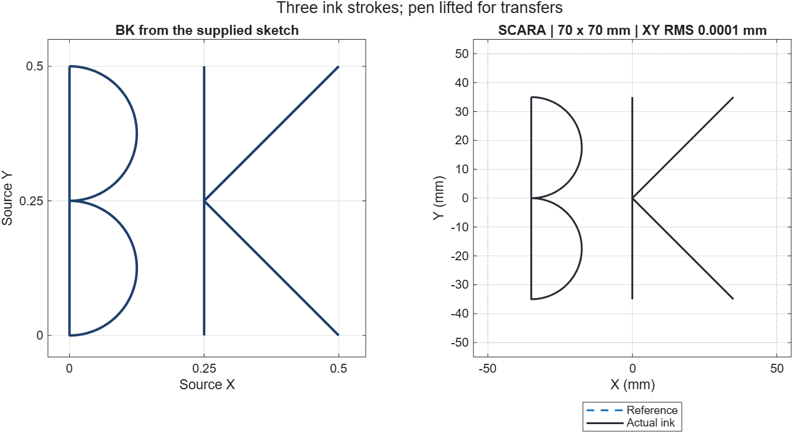
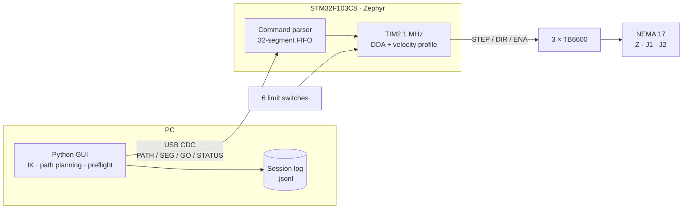
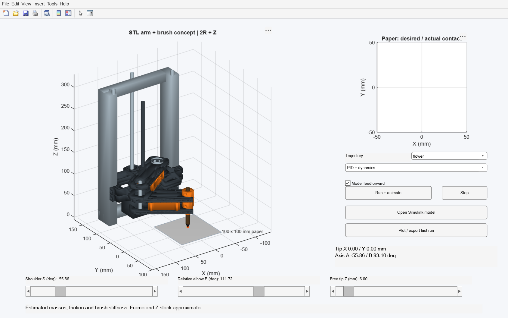
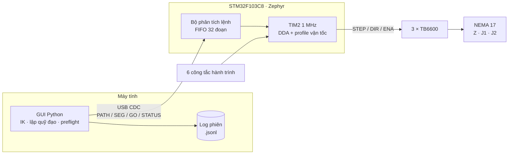

<div align="center">

# SCARA Drawing Robot

**A 2R + Z SCARA robot that draws with a pen, built on the 3D-printed X-SCARA mechanics.**<br>
Zephyr firmware for STM32F103 · Python GUI with Cartesian control · MATLAB/Simulink and Webots simulation

[](LICENSE)


&nbsp;


<sub>The real robot drawing a six-petal flower (GIF at 2× speed) · [Original video](media/drawing-demo.mp4)</sub>

**[English](#english)** · **[Tiếng Việt](#tiếng-việt)**

</div>

---

# English

## Contents

- [Demo](#demo)
- [Overview](#overview)
- [Features](#features)
- [System architecture](#system-architecture)
- [Repository layout](#repository-layout)
- [Hardware](#hardware)
- [Getting started](#getting-started)
- [Simulation](#simulation)
- [Testing](#testing)
- [Known limitations](#known-limitations)
- [Documentation](#documentation)
- [Credits & license](#credits--license)

## Demo

The robot draws a six-petal flower from the GUI, on a sheet that already has
the word **LINH** and a star from earlier runs:
[`media/drawing-demo.mp4`](media/drawing-demo.mp4).

| Wired robot | Frame, Z axis and 3 drivers | TB6600 driver |
| :---: | :---: | :---: |
|  |  |  |

More side views: [1](media/robot-side-1.jpg) · [2](media/robot-side-2.jpg) ·
[3](media/robot-side-3.jpg) · [4](media/robot-side-4.jpg).

## Overview

Course project for **HPMR (semester HK261)**: build and control a SCARA robot
that draws shapes and text on paper.

> [!NOTE]
> **The frame and arm hardware come from the open-source
> [X-SCARA project by madl3x](https://github.com/madl3x/x-scara/tree/master)** (GPL-3.0).
> The STL files, BOMs and assembly images in `Hardware/arm`, `Hardware/frame`
> and `Hardware/3D Print` belong to that project. Our own work is the firmware,
> the GUI, the simulation and the Deli EG118 pen holder.

| Parameter | Value |
| --- | --- |
| Kinematics | 2 revolute joints (shoulder J1, elbow J2) + prismatic Z axis |
| Link lengths | L1 = L2 = 98 mm |
| Transmission | 2GT belts (J1, J2), Tr8 lead screw with 2 mm lead (Z) |
| Motors / drivers | 3 × NEMA 17 + 3 × TB6600 (STEP/DIR) |
| Microcontroller | STM32F103C8 (Blue Pill), USB CDC link to the PC |
| Homing | 6 limit switches (both ends of every axis, COM–NC wiring) |
| Default drawing area | 100 × 100 mm paper |

## Features

**Firmware** — [`Firmware/ScaraCartesian`](Firmware/ScaraCartesian)
- Zephyr 3.7, build `SCARA_CART_NC_HOME_V5_R9`, protocol 5.
- Automatic HOME/CALIB: sweeps both ends of every axis and measures the elbow
  coupling ratio `k = dB/dA`.
- Step generation in a 1 MHz TIM2 interrupt with 3-axis DDA interpolation.
- 32-segment queue (`PATH`/`SEG`/`GO`) with a fixed-point quintic velocity profile.
- Safety: all 6 switches checked on every pulse edge, soft limits, 350 ms
  heartbeat, USB loss, GPIO readback and buffer underrun. Any fault clears the
  home reference and stops the robot.

**Control GUI** — [`Software`](Software)
- Python 3.12 + Tkinter + pyserial. A `--demo` mode runs without a robot.
- Forward/inverse kinematics, reach checks, and a preflight of every stroke
  before anything is sent.
- XYZ jogging, mechanical model tuning, test point sequences.
- Shape & text library: BK, LINH, THOA, six-petal flower, star, heart, circle,
  ellipse, square, triangle, rhombus. Shapes auto-fit the drawing area and the
  pen lifts between strokes.
- JSONL session logs and a log analysis tool (`cartesian_nc_audit.py`).

**Simulation** — [`Simulation`](Simulation)
- MATLAB/Simulink: FK/IK, dynamics, PID + feedforward, a 3D app built from the STL files.
- Webots: rigid-body physics, pen–paper contact, a Python controller that uses only the standard library.
- Both environments share one parameter file (`common/config/scara.json`) and the same CSV trajectories.

**Hardware** — [`Hardware`](Hardware)
- Print list for all 38 parts by color and quantity, mechanical BOMs, assembly images.
- Deli EG118 pen holder: OpenSCAD + Python source and ready-to-print STL files.

<div align="center">

<br><sub>Simulated 70 × 70 mm "BK": three continuous strokes, pen lifted between strokes.</sub>
</div>

## System architecture



The GUI solves IK and splits each stroke into segments of about 0.75 mm before
sending them. The firmware only works in motor step counts. There is no encoder,
so the displayed position is an estimate from the steps sent.

## Repository layout

```text
.
├── Firmware/
│   ├── ScaraCartesian/       Main firmware (Zephyr): src/, tests/, tools/, Hex/ (prebuilt)
│   └── Ref/                  Original STM32CubeIDE project, reference only
├── Software/
│   ├── src/                  GUI, kinematic model, protocol, shapes, logging
│   ├── tests/                Unit tests + GUI smoke tests (simulated port)
│   ├── packaging/            PyInstaller spec
│   └── reports/              Test reports and drawing analysis
├── Simulation/
│   ├── common/               Shared parameters, CSV trajectories, meshes converted from STL
│   ├── matlab/               MATLAB/Simulink: src/, simulink/, examples/, tests/
│   └── webots/               World, PROTOs, Python controller, tests/
├── Hardware/                 Frame + arm from madl3x/x-scara (GPL-3.0)
│   ├── 3D Print/             STL files sorted by color and print quantity
│   ├── arm/, frame/          Original X-SCARA STLs, BOMs, assembly images
│   └── Pen_Holder_EG118/     Pen holder (SCAD, Python, STL)
├── Doc/                      Firmware review and causes of drawing errors
└── media/                    Photos and video of the real robot
```

## Hardware

The frame (2020/2040 aluminium extrusion, three Ø8 mm rods, Tr8 lead screw) and
the arm use the
**[madl3x/x-scara](https://github.com/madl3x/x-scara/tree/master)** design
unchanged. See the original repository for the latest design and full assembly guide.

### Wiring

The TB6600 inputs are wired common-cathode: PUL−, DIR− and ENA− go to a shared GND.

| Axis | PUL+ | DIR+ | ENA+ | Limit switch (DIR HIGH end) | Limit switch (DIR LOW end) |
| --- | --- | --- | --- | --- | --- |
| Z  | PA0 | PA1  | PA2  | PA3 (top) | PA4 (bottom) |
| J1 | PA8 | PB15 | PB14 | PB0  | PB1  |
| J2 | PA6 | PA7  | PB13 | PB10 | PB11 |

Switches use **COM–NC**: COM → GND, NC → GPIO (pulled up to 3.3 V), NO left open.
The input reads LOW normally and HIGH when the switch is pressed or a wire
breaks, so a broken wire is also treated as a fault.

### 3D printing and assembly

- Print list: [`Hardware/3D Print/README.md`](Hardware/3D%20Print/README.md)
  (14 frame parts, 23 arm parts, 1 test part).
- BOMs and assembly images: [`Hardware/arm/BOM.md`](Hardware/arm/BOM.md),
  [`Hardware/frame/BOM.md`](Hardware/frame/BOM.md).
- Pen holder: [`Hardware/Pen_Holder_EG118`](Hardware/Pen_Holder_EG118).

## Getting started

### 1. Flash the firmware

Prebuilt images are in `Firmware/ScaraCartesian/Hex/`:
`SCARA_Cartesian_NC_Home_v5_R9.hex` (or `.bin`). Flash at `0x08000000` with an
ST-LINK (STM32CubeProgrammer or `st-flash`), then reset the board.

Building from source needs Zephyr SDK 0.16.8 and a `west` workspace. See
[`Firmware/ScaraCartesian/README.md`](Firmware/ScaraCartesian/README.md) and
`tools/build.ps1`, and change the `D:/zephyrproject` and `D:/zephyr-sdk`
paths to match your machine.

### 2. Run the GUI

```bash
cd Software
pip install -r requirements.txt
python src/cartesian_nc_control.py
```

Add `--demo` to run against a simulated robot without opening a real COM port.

Package a Windows EXE with PyInstaller:

```bash
powershell -ExecutionPolicy Bypass -File Software/Build_Cartesian_NC_GUI.ps1 -Python python
```

The output goes to `Software/dist/`, which is not tracked in git.

### 3. Draw

The GUI labels are in Vietnamese; the English meaning is given in brackets.

1. Pick the COM port, check the **Cơ khí** (Mechanics) settings, then press
   **HOME / CALIB**. The GUI must report firmware `SCARA_CART_NC_HOME_V5_R9`.
2. Lower the pen until it just touches the paper and confirm **Z giấy** (paper Z).
3. Open **Thư viện hình & chữ** (Shape & text library) and choose a shape, size and center.
4. Do a **Chạy khô** (dry run) first, then draw for real.
5. Stop/Esc, USB loss or a limit fault clears the home reference. HOME again afterwards.

Full usage and calibration notes (Vietnamese): [`Software/README.md`](Software/README.md).

## Simulation

| Environment | How to run | Guide |
| --- | --- | --- |
| MATLAB/Simulink | Open `Simulation/matlab` and run `run_scara` | [`Simulation/matlab/README.md`](Simulation/matlab/README.md) |
| Webots | Open `Simulation/webots/worlds/scara_draw.wbt` and press **Run** | [`Simulation/webots/README.md`](Simulation/webots/README.md) |

MATLAB does not need the Robotics System Toolbox or Simscape Multibody.
Simulink is only needed to open the `.slx` model.

<div align="center">

&nbsp;

</div>

## Testing

None of the tests need the real robot.

```bash
# GUI unit tests (add -Gui to also run the GUI smoke tests)
powershell -ExecutionPolicy Bypass -File Software/Verify_Cartesian_NC_GUI.ps1 -Python python

# Firmware: builds a host C harness and tests homing, DDA, limits and the watchdog
powershell -ExecutionPolicy Bypass -File Firmware/ScaraCartesian/tools/verify.ps1 -Gcc gcc -Python python

# Webots offline tests (Webots does not need to be installed)
python -m unittest discover -s Simulation/webots/tests -v
```

The firmware host tests need GCC (for example MSYS2 UCRT64). For MATLAB, run
the scripts in `Simulation/matlab/tests/`.

## Known limitations

Analysis of logs from the real hardware (6 homing runs, 58 strokes) shows:

- The firmware assumes the two switches of each joint are exactly 180° apart.
  The measured span is about **177.5°**, so the angle scale is off by about 1.4%.
  The pen tip lands 0.8–6 mm off and circles distort by 0.2–0.9 mm.
- The elbow coupling ratio `k` is re-measured from about 64 steps at every
  homing run, so it varies by ±1.6%. The mechanical value is **1/3**.
- Visibly kinked or curved straight lines are usually caused by backlash (belts,
  pen holder), not by the firmware.

Full analysis and proposed fixes (Vietnamese):
[`Doc/Danh_gia_Firmware_SCARA.md`](Doc/Danh_gia_Firmware_SCARA.md).

## Documentation

The detailed documents are written in Vietnamese.

| Document | Contents |
| --- | --- |
| [Doc/Danh_gia_Firmware_SCARA.md](Doc/Danh_gia_Firmware_SCARA.md) | Firmware review, causes of skewed or curved strokes |
| [Firmware/ScaraCartesian/README.md](Firmware/ScaraCartesian/README.md) | Wiring, homing, protections, build |
| [Software/README.md](Software/README.md) | GUI usage, mechanical calibration |
| [Software/reports/drawing_audit_20261008.md](Software/reports/drawing_audit_20261008.md) | Stroke analysis from real hardware logs |
| [Simulation/README.md](Simulation/README.md) | Simulation overview and model assumptions |

## Credits & license

- **Frame and arm hardware** (STL, assembly images, BOM):
  [madl3x/x-scara](https://github.com/madl3x/x-scara/tree/master) by
  [@madl3x](https://github.com/madl3x), commit `3c7c17e`, licensed **GPL-3.0**.
- The simulation meshes and the pen holder are derived from those STL files.
  Sources and hashes are recorded in `Simulation/common/assets/manifest.json`
  and `Hardware/Pen_Holder_EG118/NOTICE.txt`.
- `Firmware/Ref` contains STM32CubeMX/HAL generated code (STMicroelectronics license).

Because it includes work derived from X-SCARA, this repository is released under
the **[GNU GPL v3.0](LICENSE)**.

<div align="right"><a href="#scara-drawing-robot">Back to top ↑</a></div>

---

# Tiếng Việt

## Mục lục

- [Hình ảnh thực tế](#hình-ảnh-thực-tế)
- [Giới thiệu](#giới-thiệu)
- [Tính năng](#tính-năng)
- [Kiến trúc hệ thống](#kiến-trúc-hệ-thống)
- [Cấu trúc thư mục](#cấu-trúc-thư-mục)
- [Phần cứng](#phần-cứng)
- [Bắt đầu nhanh](#bắt-đầu-nhanh)
- [Mô phỏng](#mô-phỏng)
- [Kiểm thử](#kiểm-thử)
- [Hạn chế đã biết](#hạn-chế-đã-biết)
- [Tài liệu](#tài-liệu)
- [Nguồn tham khảo & giấy phép](#nguồn-tham-khảo--giấy-phép)

## Hình ảnh thực tế

Video robot vẽ hoa 6 cánh bằng GUI, trên tờ giấy đã có chữ **LINH** và ngôi
sao vẽ từ các lần chạy trước: [`media/drawing-demo.mp4`](media/drawing-demo.mp4).

| Robot đã đấu dây | Khung, trục Z và 3 driver | Driver TB6600 |
| :---: | :---: | :---: |
|  |  |  |

Thêm ảnh mặt bên: [1](media/robot-side-1.jpg) · [2](media/robot-side-2.jpg) ·
[3](media/robot-side-3.jpg) · [4](media/robot-side-4.jpg).

## Giới thiệu

Project môn **HPMR (HK261)**: chế tạo và điều khiển một robot SCARA để vẽ
hình và chữ lên giấy.

> [!NOTE]
> **Phần cứng khung và tay robot lấy từ dự án mã nguồn mở
> [X-SCARA của madl3x](https://github.com/madl3x/x-scara/tree/master)** (GPL-3.0).
> Các file STL, BOM và ảnh lắp ráp trong `Hardware/arm`, `Hardware/frame`,
> `Hardware/3D Print` thuộc về dự án đó. Phần do nhóm tự làm gồm firmware,
> GUI, mô phỏng và giá kẹp bút Deli EG118.

| Thông số | Giá trị |
| --- | --- |
| Cấu hình | 2 khớp quay (vai J1, khuỷu J2) + trục Z tịnh tiến |
| Chiều dài khâu | L1 = L2 = 98 mm |
| Truyền động | Đai 2GT (J1, J2), vít me Tr8 bước 2 mm (Z) |
| Động cơ / driver | 3 × NEMA 17 + 3 × TB6600 (STEP/DIR) |
| Vi điều khiển | STM32F103C8 (Blue Pill), giao tiếp USB CDC |
| Gốc tọa độ | 6 công tắc hành trình (2 biên mỗi trục, kiểu COM–NC) |
| Vùng vẽ mặc định | Giấy 100 × 100 mm |

## Tính năng

**Firmware** — [`Firmware/ScaraCartesian`](Firmware/ScaraCartesian)
- Zephyr 3.7, bản dựng `SCARA_CART_NC_HOME_V5_R9`, protocol 5.
- HOME/CALIB tự động: quét hai biên mỗi trục, đo hệ số ghép khuỷu `k = dB/dA`.
- Phát xung bằng ngắt TIM2 1 MHz, nội suy DDA cho 3 trục.
- Hàng đợi 32 đoạn (`PATH`/`SEG`/`GO`), profile vận tốc bậc 5 dạng fixed-point.
- An toàn: kiểm tra 6 công tắc ở mỗi cạnh xung, giới hạn mềm, heartbeat 350 ms,
  mất USB, readback GPIO, cạn bộ đệm. Mọi lỗi đều hủy mốc và dừng.

**GUI điều khiển** — [`Software`](Software)
- Python 3.12 + Tkinter + pyserial. Có chế độ `--demo` không cần robot.
- Động học thuận/ngược (FK/IK), kiểm tra vùng với tới, preflight toàn bộ nét
  trước khi gửi.
- Điều khiển XYZ, chỉnh mô hình cơ khí, chuỗi điểm thử.
- Thư viện hình & chữ: BK, LINH, THOA, hoa 6 cánh, sao, trái tim, tròn, elip,
  vuông, tam giác, hình thoi. Tự co giãn vừa vùng vẽ, nâng bút giữa các nét.
- Ghi log phiên dạng JSONL và công cụ phân tích log (`cartesian_nc_audit.py`).

**Mô phỏng** — [`Simulation`](Simulation)
- MATLAB/Simulink: FK/IK, động lực học, PID + feedforward, giao diện 3D từ STL.
- Webots: vật lý vật rắn, tiếp xúc bút–giấy, controller Python chỉ dùng thư viện chuẩn.
- Hai môi trường dùng chung tham số (`common/config/scara.json`) và quỹ đạo CSV.

**Phần cứng** — [`Hardware`](Hardware)
- Danh sách 38 bản in 3D theo màu/số lượng, BOM cơ khí, ảnh hướng dẫn lắp ráp.
- Giá kẹp bút Deli EG118: mã nguồn OpenSCAD + Python, STL sẵn để in.

<div align="center">

<br><sub>Mô phỏng vẽ chữ BK 70 × 70 mm: ba nét liên tục, nhấc bút khi đổi nét.</sub>
</div>

## Kiến trúc hệ thống



GUI tính IK và chia mỗi nét thành các đoạn khoảng 0,75 mm rồi gửi xuống.
Firmware chỉ làm việc với số xung của động cơ. Robot không có encoder nên vị
trí hiển thị là ước tính từ số xung đã phát.

## Cấu trúc thư mục

```text
.
├── Firmware/
│   ├── ScaraCartesian/       Firmware chính (Zephyr): src/, tests/, tools/, Hex/ (bản dựng sẵn)
│   └── Ref/                  Dự án STM32CubeIDE gốc, chỉ để tham khảo
├── Software/
│   ├── src/                  GUI, mô hình động học, giao thức, hình vẽ, log
│   ├── tests/                Unit test + GUI smoke test (cổng giả lập)
│   ├── packaging/            File spec PyInstaller
│   └── reports/              Báo cáo kiểm thử và phân tích nét vẽ
├── Simulation/
│   ├── common/               Tham số chung, quỹ đạo CSV, mesh chuyển đổi từ STL
│   ├── matlab/               MATLAB/Simulink: src/, simulink/, examples/, tests/
│   └── webots/               World, PROTO, controller Python, tests/
├── Hardware/                 Khung + tay lấy từ madl3x/x-scara (GPL-3.0)
│   ├── 3D Print/             STL xếp theo màu/số lượng in
│   ├── arm/, frame/          STL gốc, BOM, ảnh lắp ráp của X-SCARA
│   └── Pen_Holder_EG118/     Giá kẹp bút (SCAD, Python, STL)
├── Doc/                      Đánh giá firmware và nguyên nhân sai lệch nét vẽ
└── media/                    Ảnh và video robot thật
```

## Phần cứng

Khung (nhôm định hình 2020/2040, 3 thanh trượt Ø8 mm, vít me Tr8) và tay
robot dùng nguyên thiết kế
**[madl3x/x-scara](https://github.com/madl3x/x-scara/tree/master)**.
Xem repo gốc để có bản thiết kế mới nhất và hướng dẫn lắp ráp đầy đủ.

### Đấu dây

TB6600 nối kiểu chung âm: PUL−, DIR−, ENA− nối GND chung.

| Trục | PUL+ | DIR+ | ENA+ | Công tắc biên (DIR HIGH) | Công tắc biên (DIR LOW) |
| --- | --- | --- | --- | --- | --- |
| Z  | PA0 | PA1  | PA2  | PA3 (trên) | PA4 (dưới) |
| J1 | PA8 | PB15 | PB14 | PB0  | PB1  |
| J2 | PA6 | PA7  | PB13 | PB10 | PB11 |

Công tắc nối **COM–NC**: COM → GND, NC → GPIO (kéo lên 3,3 V), chân NO bỏ trống.
Bình thường đọc LOW; khi chạm công tắc hoặc đứt dây đọc HIGH, nên đứt dây
cũng được coi là lỗi an toàn.

### In 3D và lắp ráp

- Danh sách in: [`Hardware/3D Print/README.md`](Hardware/3D%20Print/README.md)
  (14 chi tiết khung, 23 chi tiết tay, 1 mẫu thử).
- BOM và ảnh lắp ráp: [`Hardware/arm/BOM.md`](Hardware/arm/BOM.md),
  [`Hardware/frame/BOM.md`](Hardware/frame/BOM.md).
- Giá kẹp bút: [`Hardware/Pen_Holder_EG118`](Hardware/Pen_Holder_EG118).

## Bắt đầu nhanh

### 1. Nạp firmware

Bản dựng sẵn nằm ở `Firmware/ScaraCartesian/Hex/`:
`SCARA_Cartesian_NC_Home_v5_R9.hex` (hoặc `.bin`). Nạp tại địa chỉ
`0x08000000` bằng ST-LINK (STM32CubeProgrammer hoặc `st-flash`), rồi reset board.

Build lại từ mã nguồn cần Zephyr SDK 0.16.8 và môi trường `west`. Xem
[`Firmware/ScaraCartesian/README.md`](Firmware/ScaraCartesian/README.md) và
`tools/build.ps1`; sửa các đường dẫn `D:/zephyrproject`, `D:/zephyr-sdk`
cho đúng máy của bạn.

### 2. Chạy GUI

```bash
cd Software
pip install -r requirements.txt
python src/cartesian_nc_control.py
```

Thêm `--demo` để chạy với robot giả lập, không mở cổng COM thật.

Đóng gói EXE cho Windows (PyInstaller):

```bash
powershell -ExecutionPolicy Bypass -File Software/Build_Cartesian_NC_GUI.ps1 -Python python
```

Kết quả nằm trong `Software/dist/` (không đưa lên git).

### 3. Vẽ

1. Chọn cổng COM, kiểm tra thông số **Cơ khí**, rồi bấm **HOME / CALIB**.
   GUI phải báo firmware `SCARA_CART_NC_HOME_V5_R9`.
2. Hạ bút vừa chạm giấy, lấy/xác nhận **Z giấy**.
3. Mở **Thư viện hình & chữ**, chọn hình, cỡ và tâm.
4. **Chạy khô** trước, sau đó mới vẽ thật.
5. Khi bấm Dừng/Esc, mất USB hoặc gặp lỗi biên, robot mất mốc: cần HOME lại.

Chi tiết cách dùng và hiệu chỉnh: [`Software/README.md`](Software/README.md).

## Mô phỏng

| Môi trường | Cách chạy | Hướng dẫn |
| --- | --- | --- |
| MATLAB/Simulink | Mở `Simulation/matlab`, chạy `run_scara` | [`Simulation/matlab/README.md`](Simulation/matlab/README.md) |
| Webots | Mở `Simulation/webots/worlds/scara_draw.wbt`, nhấn **Run** | [`Simulation/webots/README.md`](Simulation/webots/README.md) |

MATLAB không cần Robotics System Toolbox hay Simscape Multibody. Simulink
chỉ cần khi mở file `.slx`.

<div align="center">

&nbsp;

</div>

## Kiểm thử

Các bài kiểm thử không cần robot thật.

```bash
# GUI: unit test (thêm -Gui để chạy smoke test giao diện)
powershell -ExecutionPolicy Bypass -File Software/Verify_Cartesian_NC_GUI.ps1 -Python python

# Firmware: build harness C trên máy tính, kiểm thử home/DDA/giới hạn/watchdog
powershell -ExecutionPolicy Bypass -File Firmware/ScaraCartesian/tools/verify.ps1 -Gcc gcc -Python python

# Webots: kiểm thử offline, không cần cài Webots
python -m unittest discover -s Simulation/webots/tests -v
```

Kiểm thử firmware trên máy tính cần GCC (ví dụ MSYS2 UCRT64). MATLAB:
chạy các file trong `Simulation/matlab/tests/`.

## Hạn chế đã biết

Phân tích log phần cứng thật (6 lần HOME, 58 nét vẽ) cho thấy:

- Firmware giả định hai công tắc của mỗi khớp cách nhau đúng 180°, trong khi
  đo thực tế khoảng **177,5°**. Thang góc vì vậy sai khoảng 1,4%: đầu bút
  lệch 0,8–6 mm, đường tròn méo 0,2–0,9 mm.
- Hệ số ghép khuỷu `k` được đo lại mỗi lần HOME từ khoảng 64 xung nên dao
  động ±1,6%. Giá trị đúng theo cơ khí là **1/3**.
- Nét thẳng bị gãy hoặc cong thấy rõ thường do độ rơ (đai, giá bút), không phải do firmware.

Phân tích đầy đủ và hướng sửa: [`Doc/Danh_gia_Firmware_SCARA.md`](Doc/Danh_gia_Firmware_SCARA.md).

## Tài liệu

| Tài liệu | Nội dung |
| --- | --- |
| [Doc/Danh_gia_Firmware_SCARA.md](Doc/Danh_gia_Firmware_SCARA.md) | Đánh giá firmware, nguyên nhân nét vẽ lệch/cong |
| [Firmware/ScaraCartesian/README.md](Firmware/ScaraCartesian/README.md) | Đấu dây, HOME, bảo vệ, build |
| [Software/README.md](Software/README.md) | Cách dùng GUI, hiệu chỉnh cơ khí |
| [Software/reports/drawing_audit_20261008.md](Software/reports/drawing_audit_20261008.md) | Báo cáo phân tích nét vẽ từ log thật |
| [Simulation/README.md](Simulation/README.md) | Tổng quan mô phỏng, giả định mô hình |

## Nguồn tham khảo & giấy phép

- **Phần cứng khung và tay robot** (STL, ảnh lắp ráp, BOM):
  [madl3x/x-scara](https://github.com/madl3x/x-scara/tree/master), tác giả
  [@madl3x](https://github.com/madl3x), commit `3c7c17e`, giấy phép **GPL-3.0**.
- Mesh mô phỏng và giá kẹp bút là sản phẩm dẫn xuất từ các STL trên; nguồn và
  mã băm được ghi trong `Simulation/common/assets/manifest.json` và
  `Hardware/Pen_Holder_EG118/NOTICE.txt`.
- `Firmware/Ref` chứa mã sinh tự động bởi STM32CubeMX/HAL (giấy phép của STMicroelectronics).

Vì có thành phần dẫn xuất từ X-SCARA, toàn bộ repo phát hành theo
**[GNU GPL v3.0](LICENSE)**.

<div align="right"><a href="#scara-drawing-robot">Về đầu trang ↑</a></div>

---

<div align="center">
Author / Tác giả: <a href="https://github.com/TuanLinh05">@TuanLinh05</a> · HK261
</div>
