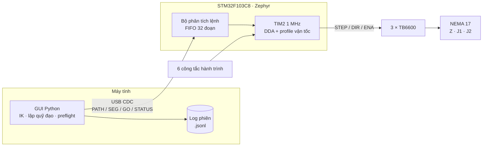

<div align="center">

# SCARA Drawing Robot

**Robot SCARA 2R + Z vẽ bằng bút, dựa trên cơ khí X-SCARA in 3D.**
Firmware Zephyr cho STM32F103, GUI Python điều khiển theo tọa độ Descartes,
mô phỏng MATLAB/Simulink và Webots.

[](LICENSE)


&nbsp;


<sub>Robot thật vẽ hoa 6 cánh (GIF tua nhanh 2×) · [Xem video gốc](media/drawing-demo.mp4)</sub>

</div>

---

## Mục lục

- [Demo](#demo)
- [Giới thiệu](#giới-thiệu)
- [Tính năng](#tính-năng)
- [Kiến trúc hệ thống](#kiến-trúc-hệ-thống)
- [Cấu trúc thư mục](#cấu-trúc-thư-mục)
- [Phần cứng](#phần-cứng)
- [Bắt đầu nhanh](#bắt-đầu-nhanh)
- [Mô phỏng](#mô-phỏng)
- [Kiểm thử](#kiểm-thử)
- [Hạn chế đã biết](#hạn-chế-đã-biết)
- [Tài liệu](#tài-liệu)
- [Nguồn tham khảo & giấy phép](#nguồn-tham-khảo--giấy-phép)

## Demo

Video robot vẽ hoa 6 cánh bằng GUI, trên tờ giấy đã có chữ **LINH** và ngôi
sao vẽ từ các lần chạy trước: [`media/drawing-demo.mp4`](media/drawing-demo.mp4).

| Robot đã đấu dây | Khung, trục Z và 3 driver | Driver TB6600 |
| :---: | :---: | :---: |
|  |  |  |

Thêm ảnh mặt bên: [1](media/robot-side-1.jpg) · [2](media/robot-side-2.jpg) ·
[3](media/robot-side-3.jpg) · [4](media/robot-side-4.jpg).

## Giới thiệu

Project môn **HPMR (HK261)**: chế tạo và điều khiển một robot SCARA để vẽ
hình và chữ lên giấy.

> [!NOTE]
> **Phần cứng khung và tay robot lấy từ dự án mã nguồn mở
> [X-SCARA của madl3x](https://github.com/madl3x/x-scara/tree/master)** (GPL-3.0).
> Các file STL, BOM và ảnh lắp ráp trong `Hardware/arm`, `Hardware/frame`,
> `Hardware/3D Print` thuộc về dự án đó. Phần do nhóm tự làm gồm firmware,
> GUI, mô phỏng và giá kẹp bút Deli EG118.

| Thông số | Giá trị |
| --- | --- |
| Cấu hình | 2 khớp quay (vai J1, khuỷu J2) + trục Z tịnh tiến |
| Chiều dài khâu | L1 = L2 = 98 mm |
| Truyền động | Đai 2GT (J1, J2), vít me Tr8 bước 2 mm (Z) |
| Động cơ / driver | 3 × NEMA 17 + 3 × TB6600 (STEP/DIR) |
| Vi điều khiển | STM32F103C8 (Blue Pill), giao tiếp USB CDC |
| Gốc tọa độ | 6 công tắc hành trình (2 biên mỗi trục, kiểu COM–NC) |
| Vùng vẽ mặc định | Giấy 100 × 100 mm |

## Tính năng

**Firmware** — [`Firmware/ScaraCartesian`](Firmware/ScaraCartesian)
- Zephyr 3.7, bản dựng `SCARA_CART_NC_HOME_V5_R9`, protocol 5.
- HOME/CALIB tự động: quét hai biên mỗi trục, đo hệ số ghép khuỷu `k = dB/dA`.
- Phát xung bằng ngắt TIM2 1 MHz, nội suy DDA cho 3 trục.
- Hàng đợi 32 đoạn (`PATH`/`SEG`/`GO`), profile vận tốc bậc 5 dạng fixed-point.
- An toàn: kiểm tra 6 công tắc ở mỗi cạnh xung, giới hạn mềm, heartbeat 350 ms,
  mất USB, readback GPIO, cạn bộ đệm. Mọi lỗi đều hủy mốc và dừng.

**GUI điều khiển** — [`Software`](Software)
- Python 3.12 + Tkinter + pyserial. Có chế độ `--demo` không cần robot.
- Động học thuận/ngược (FK/IK), kiểm tra vùng với tới, preflight toàn bộ nét
  trước khi gửi.
- Điều khiển XYZ, chỉnh mô hình cơ khí, chuỗi điểm thử.
- Thư viện hình & chữ: BK, LINH, THOA, hoa 6 cánh, sao, trái tim, tròn, elip,
  vuông, tam giác, hình thoi. Tự co giãn vừa vùng vẽ, nâng bút giữa các nét.
- Ghi log phiên dạng JSONL và công cụ phân tích log (`cartesian_nc_audit.py`).

**Mô phỏng** — [`Simulation`](Simulation)
- MATLAB/Simulink: FK/IK, động lực học, PID + feedforward, giao diện 3D từ STL.
- Webots: vật lý vật rắn, tiếp xúc bút–giấy, controller Python chỉ dùng thư viện chuẩn.
- Hai môi trường dùng chung tham số (`common/config/scara.json`) và quỹ đạo CSV.

**Phần cứng** — [`Hardware`](Hardware)
- Danh sách 38 bản in 3D theo màu/số lượng, BOM cơ khí, ảnh hướng dẫn lắp ráp.
- Giá kẹp bút Deli EG118: mã nguồn OpenSCAD + Python, STL sẵn để in.

<div align="center">

<br><sub>Mô phỏng vẽ chữ BK 70 × 70 mm: ba nét liên tục, nhấc bút khi đổi nét.</sub>
</div>

## Kiến trúc hệ thống



GUI tính IK và chia mỗi nét thành các đoạn khoảng 0,75 mm rồi gửi xuống.
Firmware chỉ làm việc với số xung của động cơ; vị trí hiển thị là ước tính
từ số xung đã phát (robot không có encoder).

## Cấu trúc thư mục

```text
.
├── Firmware/
│   ├── ScaraCartesian/       Firmware chính (Zephyr): src/, tests/, tools/, Hex/ (bản dựng sẵn)
│   └── Ref/                  Dự án STM32CubeIDE gốc, chỉ để tham khảo
├── Software/
│   ├── src/                  GUI, mô hình động học, giao thức, hình vẽ, log
│   ├── tests/                Unit test + GUI smoke test (cổng giả lập)
│   ├── packaging/            File spec PyInstaller
│   └── reports/              Báo cáo kiểm thử và phân tích nét vẽ
├── Simulation/
│   ├── common/               Tham số chung, quỹ đạo CSV, mesh chuyển đổi từ STL
│   ├── matlab/               MATLAB/Simulink: src/, simulink/, examples/, tests/
│   └── webots/               World, PROTO, controller Python, tests/
├── Hardware/                 Khung + tay lấy từ madl3x/x-scara (GPL-3.0)
│   ├── 3D Print/             STL xếp theo màu/số lượng in
│   ├── arm/, frame/          STL gốc, BOM, ảnh lắp ráp của X-SCARA
│   └── Pen_Holder_EG118/     Giá kẹp bút (SCAD, Python, STL)
├── Doc/                      Đánh giá firmware và nguyên nhân sai lệch nét vẽ
└── media/                    Ảnh và video robot thật
```

## Phần cứng

Khung (nhôm định hình 2020/2040, 3 thanh trượt Ø8 mm, vít me Tr8) và tay
robot dùng nguyên thiết kế
**[madl3x/x-scara](https://github.com/madl3x/x-scara/tree/master)**.
Xem repo gốc để có bản thiết kế mới nhất và hướng dẫn lắp ráp đầy đủ.

### Đấu dây

TB6600 nối kiểu chung âm: PUL−, DIR−, ENA− nối GND chung.

| Trục | PUL+ | DIR+ | ENA+ | Công tắc biên (DIR HIGH) | Công tắc biên (DIR LOW) |
| --- | --- | --- | --- | --- | --- |
| Z  | PA0 | PA1  | PA2  | PA3 (trên) | PA4 (dưới) |
| J1 | PA8 | PB15 | PB14 | PB0  | PB1  |
| J2 | PA6 | PA7  | PB13 | PB10 | PB11 |

Công tắc nối **COM–NC**: COM → GND, NC → GPIO (kéo lên 3,3 V), chân NO bỏ trống.
Bình thường đọc LOW; khi chạm công tắc hoặc đứt dây đọc HIGH, nên đứt dây
cũng được coi là lỗi an toàn.

### In 3D và lắp ráp

- Danh sách in: [`Hardware/3D Print/README.md`](Hardware/3D%20Print/README.md)
  (14 chi tiết khung, 23 chi tiết tay, 1 mẫu thử).
- BOM và ảnh lắp ráp: [`Hardware/arm/BOM.md`](Hardware/arm/BOM.md),
  [`Hardware/frame/BOM.md`](Hardware/frame/BOM.md).
- Giá kẹp bút: [`Hardware/Pen_Holder_EG118`](Hardware/Pen_Holder_EG118).

## Bắt đầu nhanh

### 1. Nạp firmware

Bản dựng sẵn nằm ở `Firmware/ScaraCartesian/Hex/`:
`SCARA_Cartesian_NC_Home_v5_R9.hex` (hoặc `.bin`). Nạp tại địa chỉ
`0x08000000` bằng ST-LINK (STM32CubeProgrammer hoặc `st-flash`), rồi reset board.

Build lại từ mã nguồn cần Zephyr SDK 0.16.8 và môi trường `west`. Xem
[`Firmware/ScaraCartesian/README.md`](Firmware/ScaraCartesian/README.md) và
`tools/build.ps1`; sửa các đường dẫn `D:/zephyrproject`, `D:/zephyr-sdk`
cho đúng máy của bạn.

### 2. Chạy GUI

```bash
cd Software
pip install -r requirements.txt
python src/cartesian_nc_control.py
```

Thêm `--demo` để chạy với robot giả lập, không mở cổng COM thật.

Đóng gói EXE cho Windows (PyInstaller):

```bash
powershell -ExecutionPolicy Bypass -File Software/Build_Cartesian_NC_GUI.ps1 -Python python
```

Kết quả nằm trong `Software/dist/` (không đưa lên git).

### 3. Vẽ

1. Chọn cổng COM, kiểm tra tab **Cơ khí**, rồi bấm **HOME / CALIB**.
   GUI phải báo firmware `SCARA_CART_NC_HOME_V5_R9`.
2. Hạ bút vừa chạm giấy, lấy/xác nhận **Z giấy**.
3. Mở **Thư viện hình & chữ**, chọn hình, cỡ và tâm.
4. **Chạy khô** trước, sau đó mới vẽ thật.
5. Khi bấm Dừng/Esc, mất USB hoặc gặp lỗi biên, robot mất mốc: cần HOME lại.

Chi tiết cách dùng và hiệu chỉnh: [`Software/README.md`](Software/README.md).

## Mô phỏng

| Môi trường | Cách chạy | Hướng dẫn |
| --- | --- | --- |
| MATLAB/Simulink | Mở `Simulation/matlab`, chạy `run_scara` | [`Simulation/matlab/README.md`](Simulation/matlab/README.md) |
| Webots | Mở `Simulation/webots/worlds/scara_draw.wbt`, nhấn **Run** | [`Simulation/webots/README.md`](Simulation/webots/README.md) |

MATLAB không cần Robotics System Toolbox hay Simscape Multibody. Simulink
chỉ cần khi mở file `.slx`.

<div align="center">

&nbsp;

</div>

## Kiểm thử

Các bài kiểm thử không cần robot thật.

```bash
# GUI: unit test (thêm -Gui để chạy smoke test giao diện)
powershell -ExecutionPolicy Bypass -File Software/Verify_Cartesian_NC_GUI.ps1 -Python python

# Firmware: build harness C trên máy tính, kiểm thử home/DDA/giới hạn/watchdog
powershell -ExecutionPolicy Bypass -File Firmware/ScaraCartesian/tools/verify.ps1 -Gcc gcc -Python python

# Webots: kiểm thử offline, không cần cài Webots
python -m unittest discover -s Simulation/webots/tests -v
```

Kiểm thử firmware trên máy tính cần GCC (ví dụ MSYS2 UCRT64). MATLAB:
chạy các file trong `Simulation/matlab/tests/`.

## Hạn chế đã biết

Phân tích log phần cứng thật (6 lần HOME, 58 nét vẽ) cho thấy:

- Firmware giả định hai công tắc của mỗi khớp cách nhau đúng 180°, trong khi
  đo thực tế khoảng **177,5°**. Thang góc vì vậy sai khoảng 1,4%: đầu bút
  lệch 0,8–6 mm, đường tròn méo 0,2–0,9 mm.
- Hệ số ghép khuỷu `k` được đo lại mỗi lần HOME từ khoảng 64 xung nên dao
  động ±1,6%. Giá trị đúng theo cơ khí là **1/3**.
- Nét thẳng bị gãy hoặc cong thấy rõ thường do độ rơ (đai, giá bút), không phải do firmware.

Phân tích đầy đủ và hướng sửa: [`Doc/Danh_gia_Firmware_SCARA.md`](Doc/Danh_gia_Firmware_SCARA.md).

## Tài liệu

| Tài liệu | Nội dung |
| --- | --- |
| [Doc/Danh_gia_Firmware_SCARA.md](Doc/Danh_gia_Firmware_SCARA.md) | Đánh giá firmware, nguyên nhân nét vẽ lệch/cong |
| [Firmware/ScaraCartesian/README.md](Firmware/ScaraCartesian/README.md) | Đấu dây, HOME, bảo vệ, build |
| [Software/README.md](Software/README.md) | Cách dùng GUI, hiệu chỉnh cơ khí |
| [Software/reports/drawing_audit_20261008.md](Software/reports/drawing_audit_20261008.md) | Báo cáo phân tích nét vẽ từ log thật |
| [Simulation/README.md](Simulation/README.md) | Tổng quan mô phỏng, giả định mô hình |

## Nguồn tham khảo & giấy phép

- **Phần cứng khung và tay robot** (STL, ảnh lắp ráp, BOM):
  [madl3x/x-scara](https://github.com/madl3x/x-scara/tree/master), tác giả
  [@madl3x](https://github.com/madl3x), commit `3c7c17e`, giấy phép **GPL-3.0**.
- Mesh mô phỏng và giá kẹp bút là sản phẩm dẫn xuất từ các STL trên; nguồn và
  mã băm được ghi trong `Simulation/common/assets/manifest.json` và
  `Hardware/Pen_Holder_EG118/NOTICE.txt`.
- `Firmware/Ref` chứa mã sinh tự động bởi STM32CubeMX/HAL (giấy phép của STMicroelectronics).

Vì có thành phần dẫn xuất từ X-SCARA, toàn bộ repo phát hành theo
**[GNU GPL v3.0](LICENSE)**.

---

<div align="center">
Tác giả: <a href="https://github.com/TuanLinh05">@TuanLinh05</a> · HK261
</div>
